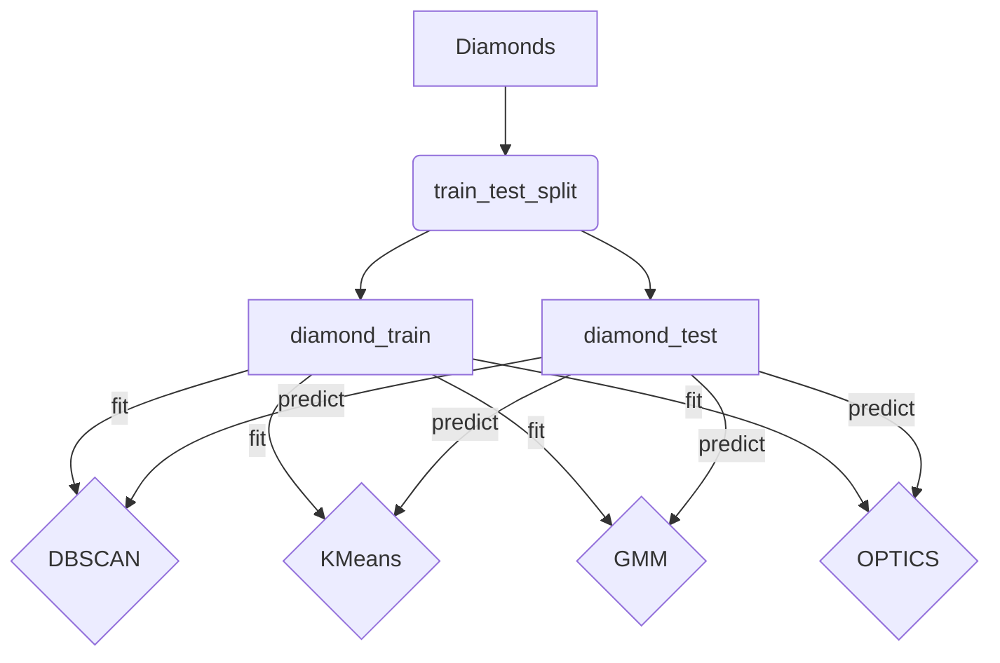

## CPSC 419 Project Outline

---

1. __Dataset__
    
   - The [diamonds dataset](https://github.com/mwaskom/seaborn-data/blob/master/diamonds.csv) from [Seaborn](https://github.com/mwaskom/seaborn-data) will be used
 
  
2. __Data Cleaning__

   - As of currently, NaN/Null values will be dropped from the table.
 

3. __Supervised Learning__

   - Using linear regression to determine the classification of the diamonds in the given set
   - Will be trained using simple train/test
   - Will be measured via a confusion matrix
 

4. __Unsupervised Learning__  - James Heathcock

   - The algorithms used will be:
     1. OPTICS
     2. DBSCAN
     3. Gaussian-Mixture Model
     4. k-Means
   - t-SNE is used for dimensionality reduction
     

5. __Wrap-up__/__Conclusions__

6. __References__
 

---
#### Contributors
 - James Heathcock
 - _Add Name_
